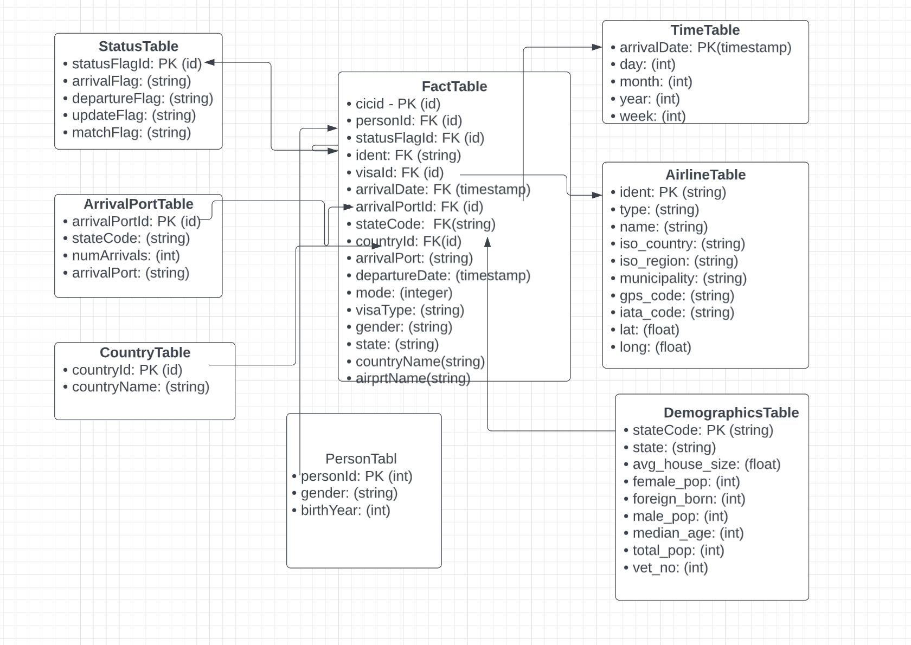

## Project Scope
* The Udacity project has the following datasets available
   1. USA Immigration data 
   2. USA Airline data
   3. USA Demographics data

* Using these we plan to create a datalake front where we rearrange this
information in a star schema using facts and dimension tables

* The datalake front is created as an ETL pipeline implemented in
jupyter notebook using 
  * Postgres as backend(for a Proof Of Concept)
  * Spark as processing engine (for a full application)
* The intended end use of this project is to have a source-of-truth database that is queryable in a data lake.
* Some examples of the information which can be queries from the data model include the numbers of visitors by nationality, visitor’s main country of residence, their demographics and flight information. Python is the main language used to complete the project. The libraries used to perform ETL are Pandas and Pyspark. The environment used is locally setup using docker. 
* These parquest files were ingested and explored using Pandas to gain an understanding of the data and before building a conceptual data model. Pyspark was then used to build the ETL pipeline. The data sources provided have been cleaned, transformed to create new features and then save the data tables are parquet file. The two notebooks with all the code and output are as follows:

## Explore and assess the data
* Following are the dimension and schema of the data (rows, columns)
  * Immigration data : (3096313 rows, 28 columns) 
    |    | Field    | Type   | Nullable |
    |----|----------|--------|----------|
    | 0  | cicid    | double | True     |
    | 1  | i94yr    | double | True     |
    | 2  | i94mon   | double | True     |
    | 3  | i94cit   | double | True     |
    | 4  | i94res   | double | True     |
    | 5  | i94port  | string | True     |
    | 6  | arrdate  | double | True     |
    | 7  | i94mode  | double | True     |
    | 8  | i94addr  | string | True     |
    | 9  | depdate  | double | True     |
    | 10 | i94bir   | double | True     |
    | 11 | i94visa  | double | True     |
    | 12 | count    | double | True     |
    | 13 | dtadfile | string | True     |
    | 14 | visapost | string | True     |
    | 15 | occup    | string | True     |
    | 16 | entdepa  | string | True     |
    | 17 | entdepd  | string | True     |
    | 18 | entdepu  | string | True     |
    | 19 | matflag  | string | True     |
    | 20 | biryear  | double | True     |
    | 21 | dtaddto  | string | True     |
    | 22 | gender   | string | True     |
    | 23 | insnum   | string | True     |
    | 24 | airline  | string | True     |
    | 25 | admnum   | double | True     |
    | 26 | fltno    | string | True     |
    | 27 | visatype | string | True     |

  * Demographics data: (2891 rows, 12 columns)
    |    | Field                  | Type   | Nullable |
    |----|------------------------|--------|----------|
    | 0  | City                   | string | True     |
    | 1  | State                  | string | True     |
    | 2  | Median Age             | string | True     |
    | 3  | Male Population        | string | True     |
    | 4  | Female Population      | string | True     |
    | 5  | Total Population       | string | True     |
    | 6  | Number of Veterans     | string | True     |
    | 7  | Foreign-born           | string | True     |
    | 8  | Average Household Size | string | True     |
    | 9  | State Code             | string | True     |
    | 10 | Race                   | string | True     |
    | 11 | Count                  | string | True     |
  * Airlines data: (55075 rows, 12 columns)
    |    | Field        | Type   | Nullable |
    |----|--------------|--------|----------|
    | 0  | ident        | string | True     |
    | 1  | type         | string | True     |
    | 2  | name         | string | True     |
    | 3  | elevation_ft | string | True     |
    | 4  | continent    | string | True     |
    | 5  | iso_country  | string | True     |
    | 6  | iso_region   | string | True     |
    | 7  | municipality | string | True     |
    | 8  | gps_code     | string | True     |
    | 9  | iata_code    | string | True     |
    | 10 | local_code   | string | True     |
    | 11 | coordinates  | string | True     |

* Steps taken to clean the data
    * All immgigration data is filtered for age >= 0 and non null "cicid" fields.
    * Count, dtadfile, admnum, i94res, dtaddto, occup, visapost can be dropped as these do not provide any extra information or have high missing values.
    * Demographic data is aggregated to give average or median valus for all the quantities state wise
    * Removed city and race from Demographics
    * Flight data is cleaned in postgres ETL, loading mismatching IATA code by manually using the https://uk.flightaware.com/
    * Duplicates and key null values are dropped prior to processing
    * Convert the data types of the columns
   

* Observations
    * The dates are stored in SAS date format, which is a value that represents the number of days between January 1, 1960, and a specified date. We need to convert the dates in the dataframe to a string date format in the pattern YYYY-MM-DD.
    * Demographic dataset doesnot have many missing values but has data for only 48 states.
    * Most of the iata_code are missing. Almost 50% of local codes are also missing

## Define the data model
* The data model consists of 7 dimensional tables (country, time, person, arrival, airline,
status and demographics) and 1 fact table called FactTable
* Here is the diagram of the Star schema based datalake front end that we are building

* In the two ETL pipelines, the naming of fields is not done to match exactly on both side, but a case insensitive match would be same
* Dimensions table provides the “who, what, where, when, why, and how” context surrounding a business process event. In this project, a dimension is single valued when associated with a given fact row. Every dimension table has a single primary key column. This primary key is embedded as a foreign key in the associated fact table where the dimension row’s descriptive context is exactly correct for that fact table row.
* The fact table focuses on the results of a single business process. A single fact table row has a one-to-one relationship to a measurement event as described by the fact table’s grain. Thus a fact table design is entirely based on a physical activity and is not influenced by the demands of a particular report. Within a fact table, only facts consistent with the declared grain are allowed. In this project, the information about the visitor is the fact. The fact table is transactional with each row corresponding to a measurement event at a point in space and time. The fact table contains foreign keys for each of its associated dimensions, as well as date stamps. Fact tables are the primary target of computations and dynamic aggregations arising from queries.

##  Run ETL to Model the Data
### How to run the code:
- Make sure you are inside the final_submission directory
- A prerequisite is to have a working setup of docker and docker compose
- Go to final_submission/docker setup and run the command `docker compose up`
- It creates two containers one with postgres database and another with pg adminer database
- Pg adminer is used to observe or model the data in the postgres database
- ** It is important to manually delete the voulme mentioned in the postgres_data directory if you plan to run the folder from multiple locations**
* Once the postgres server is up and running, run the command `jupyter notebook` in the final_submission directory.
* Make sure you can assign your environment to the ipykernel, follow instructions [here](https://medium.com/@nrk25693/how-to-add-your-conda-environment-to-your-jupyter-notebook-in-just-4-steps-abeab8b8d084)
* Once the server is up, check the **DB_WORK.ipynb** file and execute its contents one by one
* There are comments on each step on how to create the ETL pipeline by creating dimension tables first and then joining them to form the fact table
* Once you are satisfied with the output of the postgres ETL, you can switch to run the pyspark notebook
* The outputs in the postgres ETL pipeline are written to postgres DB which can be seen via pg Adminer, running on http://localhost:5050
* The pyspark notebook is again a docker container containing the pyspark environmenet
* To start it , run `docker run -it -p <LOCAL PORT>:8888 -v /your/path/to/final_submission:/home/jovyan/work  jupyter/pyspark-notebook start.sh jupyter notebook --NotebookApp.token=''`
* Once this notebook is up, it opens in the same location as the **DB_WORK.ipynb**, the code is in SparkWork.ipynb file.
* We read the whole data but in order to run it in a single machine we scale it down, but if you comment this code, you will run the ETL on entire data pipeline
* We create all dimension tables like country, time, person, status, demographics and arrival which has a simple primary key foreign key relationship.
* For the dimension table airline, the arrival port in immigration should match to the IATA code in the airline, for smaller datasets I have manually figured out the mismatchs from [here](https://uk.flightaware.com/)
* But for larger datasets we drop the non matching rows
* Finally as the spark ETL concludes we see we have a fact table of shape ==> (100612, 17)
with a 40% sample.
* The output in spark ETL is written to spark_output_parquet table in the finalSubmission directory.
* Schema deails for output tables (both fact and dimensions)
- Airlines (Dimension table)
    |    | Field        | Type   | Nullable |
    |----|--------------|--------|----------|
    | 0  | ident        | string | True     |
    | 1  | type         | string | True     |
    | 2  | name         | string | True     |
    | 3  | iso_country  | string | True     |
    | 4  | iso_region   | string | True     |
    | 5  | municipality | string | True     |
    | 6  | gps_code     | string | True     |
    | 7  | iata_code    | string | True     |
    | 8  | isoRegion    | string | True     |
    | 9  | lat          | float  | True     |
    | 10 | long         | float  | True     |

- Demographics (Dimension table)
    |    | Field                  | Type   | Nullable |
    |----|------------------------|--------|----------|
    | 0  | City                   | string | True     |
    | 1  | State                  | string | True     |
    | 2  | Median Age             | string | True     |
    | 3  | Male Population        | string | True     |
    | 4  | Female Population      | string | True     |
    | 5  | Total Population       | string | True     |
    | 6  | Number of Veterans     | string | True     |
    | 7  | Foreign-born           | string | True     |
    | 8  | Average Household Size | string | True     |
    | 9  | State Code             | string | True     |
    | 10 | Race                   | string | True     |
    | 11 | Count                  | string | True     |
    
- Country (Dimension table)
    |   | Field       | Type    | Nullable |
    |---|-------------|---------|----------|
    | 0 | countryId   | integer | True     |
    | 1 | countryName | string  | True     |
- Person (Dimension table)
    |   | Field     | Type    | Nullable |
    |---|-----------|---------|----------|
    | 0 | birthYear | integer | True     |
    | 1 | gender    | string  | True     |
    | 2 | personId  | long    | False    |
- Arrival (Dimension table)
    |   | Field             | Type   | Nullable |
    |---|-------------------|--------|----------|
    | 0 | arrivalPort       | string | True     |
    | 1 | numArrivalAddress | long   | False    |
    | 2 | arrivalPortId     | long   | False    |
    | 3 | arrivalPort_      | string | True     |
    | 4 | stateCode         | string | True     |
- Time (Dimension table)
    |   | Field   | Type    | Nullable |
    |---|---------|---------|----------|
    | 0 | time    | date    | True     |
    | 1 | day     | integer | True     |
    | 2 | month   | integer | True     |
    | 3 | year    | integer | True     |
    | 4 | week    | integer | True     |
    | 5 | weekday | integer | True     |
- Status (Dimension table)
    |   | Field         | Type   | Nullable |
    |---|---------------|--------|----------|
    | 0 | arrivalFlag   | string | True     |
    | 1 | departureFlag | string | True     |
    | 2 | updateFlag    | string | True     |
    | 3 | matchFlag     | string | True     |
    | 4 | statusFlagId  | long   | False    |
- Fact (Fact table)
    |    | Field         | Type    | Nullable |
    |----|---------------|---------|----------|
    | 0  | cicid         | integer | True     |
    | 1  | arrivalDate   | date    | True     |
    | 2  | departureDate | date    | True     |
    | 3  | mode          | integer | True     |
    | 4  | visaId        | integer | True     |
    | 5  | visaType      | string  | True     |
    | 6  | gender        | string  | True     |
    | 7  | arrivalPort   | string  | True     |
    | 8  | statusFlagId  | long    | False    |
    | 9  | countryId     | integer | True     |
    | 10 | countryName   | string  | True     |
    | 11 | personId      | long    | False    |
    | 12 | arrivalPortId | long    | False    |
    | 13 | ident         | string  | True     |
    | 14 | airportName   | string  | True     |
    | 15 | State Code    | string  | True     |
    | 16 | State         | string  | True     |
        

## Complete Project Write Up
* Description of how to approach the problem differently under the following scenarios:
    * The data was increased by 100x.1. :: 
        Use of Redshift (https://aws.amazon.com/redshift/). It allows querying petabytes of structured and semi-structured data across the data warehouse2. Use of Cassandra (http://cassandra.apache.org/). It offers robust support for clusters spanning multiple datacenters with asynchronous masterless replication allowing low latency operations for all clients.
    * The data populates a dashboard that must be updated on a daily basis by 7am every       day.1. For small datasets, a cron job will be sufficient2. Use of Airflow       (https://airflow.apache.org/docs/stable/macros.html)
    * The database needed to be accessed by 100+ people.1.::
        Use of Redshift with auto-scaling capabilities and good read performance2. Use of Cassandra with pre-defined indexes to optimize read queries3. Use of Elastic Map Reduce (https://aws.amazon.com/emr/). It allows provisioning one, hundreds, or thousands of compute instances to process data at any scale.

